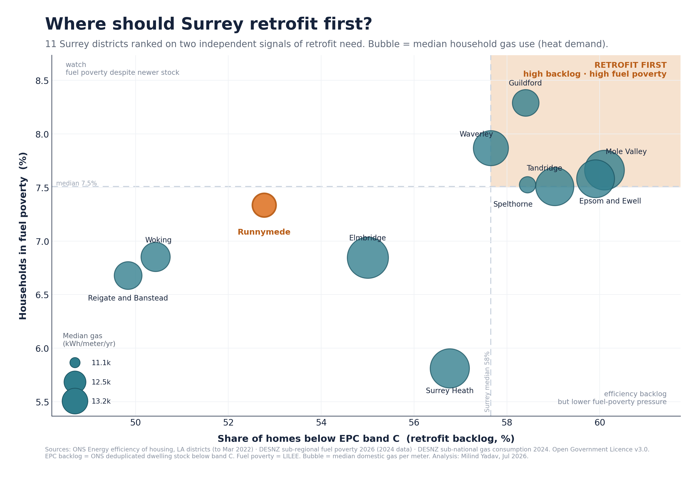

# Where Should Surrey Retrofit First?

A decision-support analysis that ranks the **11 Surrey districts** by home-retrofit
need, using three open UK government datasets. The goal is one honest answer to a
practical question: *if you had limited money to insulate homes and cut heating
bills, where would you start?*

No weighted "black-box" score. No machine learning. Transparent metrics, one chart.



## Headline finding

Ranking on two **independent** signals of need — efficiency backlog (homes below
EPC band C) and household fuel poverty — the priority districts are
**Guildford, Waverley, Mole Valley, Epsom & Ewell and Tandridge** (top-right).

**Runnymede is not a top-need district.** It sits mid-pack on fuel poverty and has
one of the *lower* efficiency backlogs. Where it stands out is being the **most off
the mains-gas grid (~21% of homes)** — which changes the *type* of retrofit needed
(heat pumps rather than boiler-efficiency measures), not the urgency.

Full ranked table: [`docs/findings.md`](docs/findings.md).

## Data sources (all Open Government Licence v3.0)

| Metric | Source |
|---|---|
| % of homes below EPC band C · % on mains gas · median efficiency score | ONS — *Energy efficiency of housing, England & Wales, local authority districts* (to FYE Mar 2022) |
| % of households in fuel poverty (LILEE) | DESNZ — *Sub-regional fuel poverty 2026*, Table 2 (2024 data) |
| Median domestic gas use (kWh/meter) | DESNZ — *Sub-national gas consumption statistics 2024* |
| Cross-check: recent EPC lodgements by band | MHCLG — *EPC live tables*, Table EB1 |

Raw files are in [`data/`](data/).

## The chart

`outputs/surrey_retrofit_quadrant.png`
- **X** — share of homes below EPC band C (retrofit backlog)
- **Y** — households in fuel poverty
- **Bubble size** — median household gas use (heat-demand proxy)
- Split lines are Surrey medians; the top-right quadrant is "retrofit first".

## Method, in one line

Districts are ranked on two independent need signals and plotted together — no
composite score to hide the reasoning, so anyone can see exactly why a district
lands where it does.

## Limitations

- The ONS stock EPC data is to March 2022 (the latest deduplicated LA-level stock
  release); housing efficiency changes slowly, so the *relative* ranking is stable.
- A cross-check against recent EPC lodgements (MHCLG EB1, 2024–Q1 2026) gives a
  positive but moderate rank correlation (r ≈ 0.48) — expected, since lodged
  certificates are a *flow* biased toward property sales, not the standing stock.
- EPC data covers homes that have been assessed, not 100% of dwellings.

## Reproduce

```bash
python src/01_build_dataset.py     # join sources -> outputs/surrey_retrofit_master.csv
python src/02_plot_quadrant.py     # -> outputs/surrey_retrofit_quadrant.png
```
Requires: `pandas`, `numpy`, `matplotlib`, `odfpy`.

## Structure

```
surrey-retrofit-priority/
├── README.md
├── data/          raw open-government source files
├── src/           01 build dataset · 02 plot chart
├── outputs/       master.csv + quadrant.png
└── docs/          ranked findings table
```

---
*Analysis: Milind Yadav, July 2026. Contains public sector information licensed
under the Open Government Licence v3.0.*
